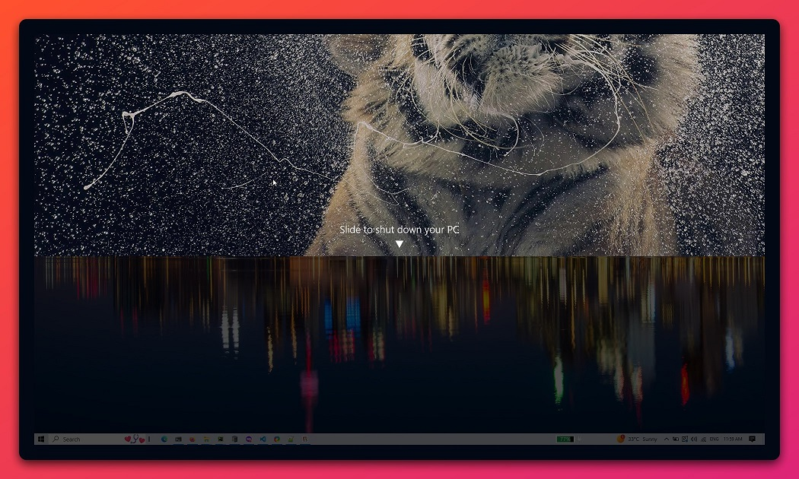

# slide to shutdown
slideToShutdown is an exe present in system32 folder. When clicked, this slides down your desktop backgroud till mid screen and gives you an option to shutdown your pc by further sliding it down. 
You can create a shortcut on your desktop, name it slideToShutDown and windows automatically link it with the mentioned exe, gives you an easy access to shutdown your pc.

